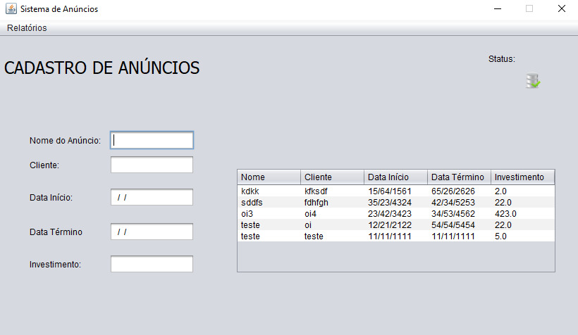

## INTRODUÇÃO
O programa faz o cadastro de anúncios da empresa fictícia "Divulga Tudo", mostrando na tabela o nome do anúncio, cliente, data de início e término e por fim, investimento.

## INSTALAÇÃO
Para executar o Sistema de Cadastro de Anúncios será necessário instalar os seguintes programas:

1) Xampp - Para iniciar o MySQL no localhost, na porta 3306 da sua máquina;
2) MySQL Workbench - Para executar o arquivo "bd.sql" e assim obter a tabela do sistema de cadastro de anúncios.
3) IDE Java (Preferencialmente NetBeans 8.2) - Para executar o código da "TelaInicial" e ver o sistema de cadastro de anúncios.

E pronto, agora é só fazer o cadastro dos anúncios!

## VISÃO GERAL
O programa conta com uma tela inicial que contém os campos de texto para serem preenchidos e logo após são cadastrados e visualizados na tabela do lado esquerdo.

## CRÉDITOS
Criado por Glacy Gomes com o objetivo de realizar o desafio de programação para o seletivo da Academia Capgemini realizado pela Proway.